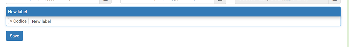
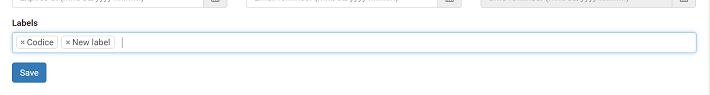

# Labels

Labels are Codice's way to categorize notes. They are no different from tags that you may
know from other applications. Each note can have multiple tags and that's about all we can
say about labels. Oh, and you can assign colors to your labels so everything becomes clear
at the quick glance when you look at the notes.

### Label view
Remeber this label area we talked about in previous chapter? You can click on a label
to get into label view - only notes with that label will be shown.

You can also go to *Labels* (top navigation bar) and click any label from there - result
will be exactly the same.

### Assigning labels
You can assign labels while creating or editing note. Of course you can de-assign them at
any time. Quickform described in [Basic concepts](basics) chapter fully supports label
creation. Moreover, when you are in label view (see above), it has preselected currently
shown label.

### Creating new labels
You can create new labels in two ways. First is using *Labels* section in top navigation bar,
press *Add new label* and fill in the form. You can also set a color for the label there.

But, what is not obvious, you can also create new labels while creating or editing a note
without leaving the page. Labels input provides autocompletion, but if you type in label which
does not exist yet and press enter it will assign it anyway. Label will be created once the
note is saved.

The only difference to adding labels using dedicated page is the fact that default (grey)
color will be assigned to it. You can of course change it later by editing that label.

### Editing a label
Editing a label is pretty straightforward. Go to the *Labels* on the top navigation bar
and press *Edit* button next to an item you are interested in. You can change color
and the name of label.

### Deleting a label
Just one thing worth noting here: when you have a label unassigned from every note
it was previously assigned to (or completely remove those notes), a label is still
present in the system - it is not deleted and you can use it any time later.

To remove a label head into *Labels* on top navigation bar and click *Delete* button next
to it. Removing a label unassigns it from notes, if it has any. Notes will not get deleted.
